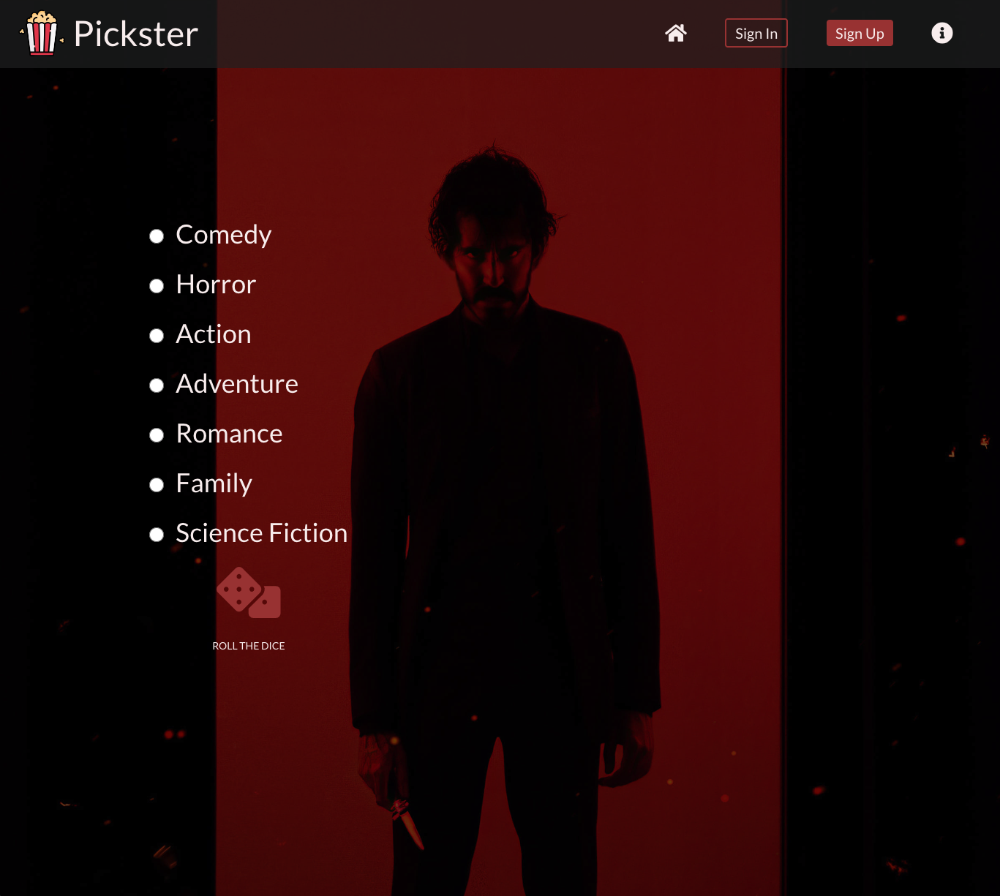
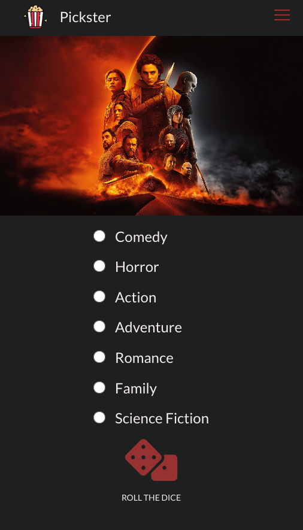
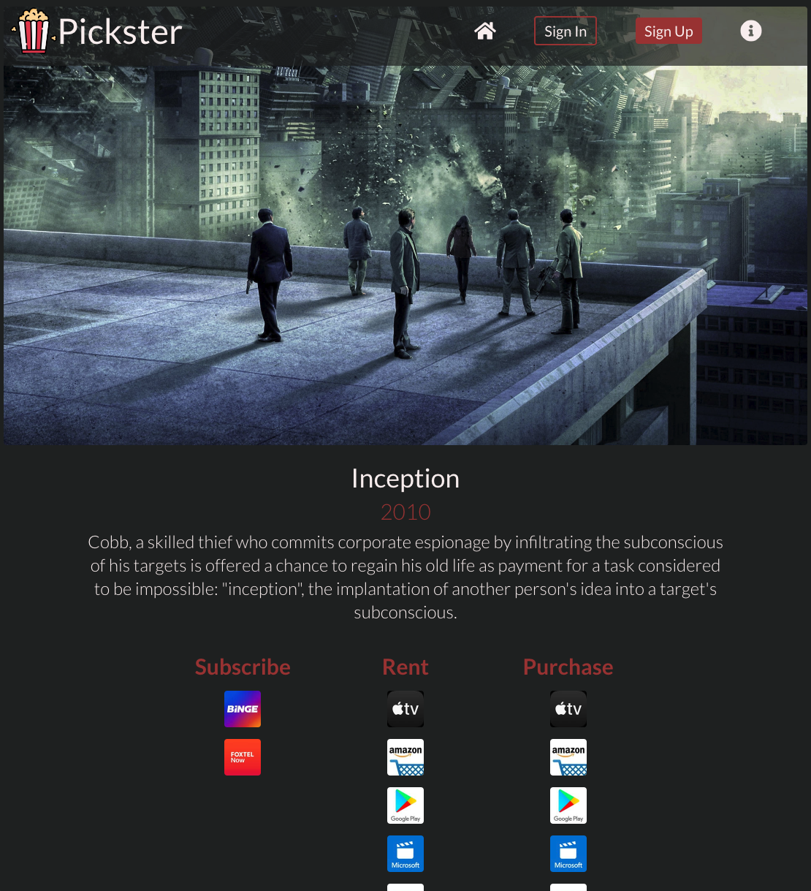
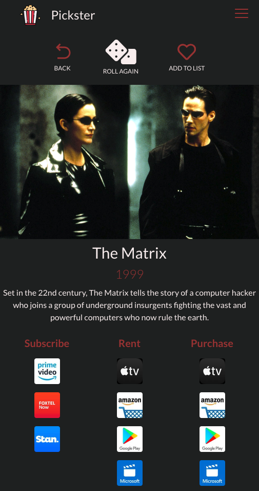
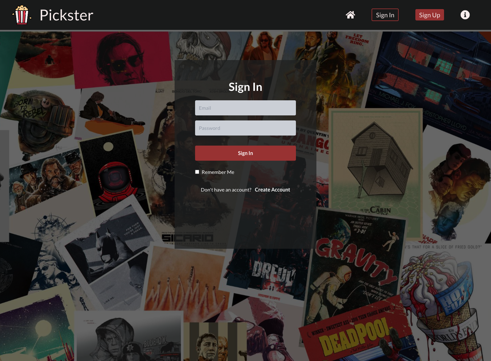
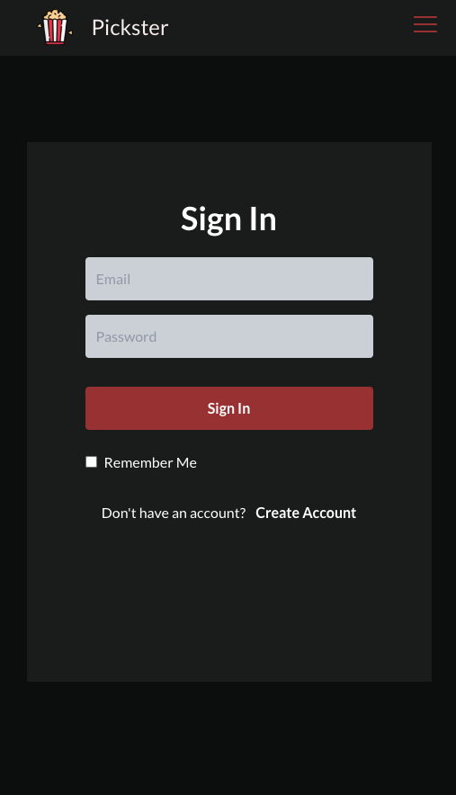

# Pickster with React + Vite & Firebase
- A responsively designed app for generating a random movie suggestion based on a chosen genre from a user
- If the user is interested in watching it another time they can save it to a 'watch later list'
- The app utilises The Movie Database's API to provide information on movies including which streaming services offer it to rent/buy/watch with a subscription

## Plans
-	Provider/Subscription Preferences (e.g only generate movies available on netflix)
-	Link to streaming service (TMDB has no deep links so thinking about what to do)

## Libraries & Frameworks
- Tailwind CSS
- React Icons
- Axios

## API
- The Movie Database (TMDB)

## Screenshots

#### Homepage: Desktop

#### Homepage: Mobile

#### Result Page: Desktop

#### Result Page: Mobile

#### Sign In Page: Desktop

#### Sign In Page: Mobile

